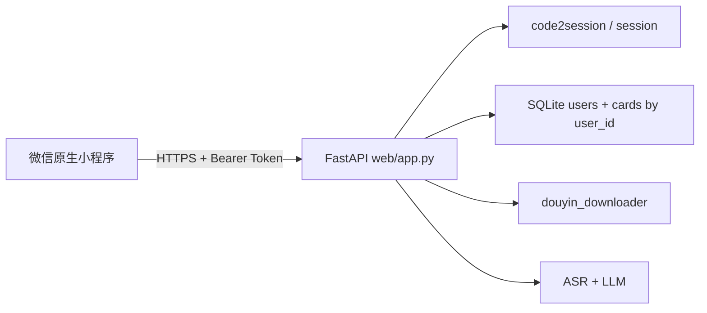

# 微信原生小程序 + 用户隔离改造计划

> 状态：**已确认可行，待实施**（文档先行，代码未动）。
> 配套阅读：[`DESIGN.md`](DESIGN.md)、[`FRONTEND_REFACTOR_PLAN.md`](FRONTEND_REFACTOR_PLAN.md)、[`../PROGRESS.md`](../PROGRESS.md)。

---

## 目标与边界

- **前端**：新建微信原生小程序（WXML/WXSS/JS），信息架构对齐现有三 Tab：收集 / 知识库 / 问答（见 [FRONTEND_REFACTOR_PLAN.md](FRONTEND_REFACTOR_PLAN.md)）。
- **后端**：复用 [web/app.py](../web/app.py) 的 JSON 契约，**增加微信登录与按用户隔离**；密钥、ffmpeg、ASR、LLM 仍全部在服务端。
- **不做**：uni-app/Taro、社交分享、商业化；不把 API Key 放进小程序。



### 可行性结论

| 维度 | 结论 |
|---|---|
| API 契约 | 现有 `/api/cards/*`、`/api/chat`、`/api/video/extract*`、`/api/documents/parse` 已前后端解耦，小程序可直接消费 |
| 信息架构 | Web 三 Tab 与 [FRONTEND_REFACTOR_PLAN.md](FRONTEND_REFACTOR_PLAN.md) 一致，可平移为小程序 Tab |
| 数据隔离 | `video_id` 全局 UNIQUE → `UNIQUE(user_id, video_id)` + CRUD/FTS 强制 `user_id`，SQLite 可幂等迁移 |
| 鉴权 | 标准 `wx.login` → `code2session` → Bearer token；WebUI 用 `ALLOW_LOCAL_AUTH` 兼容 |
| 部署前提 | 公网 HTTPS + 备案域名 + 微信合法域名白名单（非代码，列入清单） |

---

## 一、数据模型改造（用户隔离核心）

当前 [web/core/db.py](../web/core/db.py) 中 `video_id` 全局 `UNIQUE`，且无 `user_id`，必须改：

1. 新增 `users` 表：
   - `id`, `openid`（UNIQUE）, `unionid`（可空）, `created_at`, `last_login_at`
2. `knowledge_cards` 增加 `user_id INTEGER NOT NULL`（外键 → `users.id`）
3. 去重改为 **`UNIQUE(user_id, video_id)`**（同一用户不重复入库；不同用户可存同一视频）
4. 所有 CRUD / FTS 检索 / `retrieve` 强制带 `user_id` 条件（[web/core/retrieve.py](../web/core/retrieve.py) 同步改）
5. 迁移策略：启动时幂等迁移；已有数据归属默认本地用户 `openid=local-web`，保证现有 Web 自用数据不丢

---

## 二、后端鉴权与 API 改造

### 新增鉴权

| 项 | 方案 |
|---|---|
| 登录 | `POST /api/auth/wechat/login`：小程序 `wx.login` 的 `code` → 服务端调微信 `code2session` → 签发会话 |
| 会话 | 服务端签发 **HMAC 签名 token**（或 SQLite `sessions` 表），有效期可续期；小程序存 `wx.setStorageSync` |
| 请求头 | `Authorization: Bearer <token>` |
| 依赖注入 | 新增 `get_current_user`；卡片/问答/转写/任务接口一律按 `user.id` 作用域执行 |
| 配置 | `WECHAT_APPID` / `WECHAT_SECRET` / `SESSION_SECRET`（写入 `.env.example`） |

### 现有 API 行为变更（契约尽量兼容，加鉴权与作用域）

- 需登录并按用户隔离：`/api/cards/*`、`/api/chat`、`/api/video/extract*`、`/api/documents/parse`、任务轮询
- 任务内存字典 `_tasks` / `_extract_tasks`：写入 `user_id`，轮询时校验归属，防越权
- CORS：为小程序合法域名 / 开发工具加 `CORSMiddleware`（小程序主要走微信域名白名单，H5 调试需要）
- WebUI 兼容：无微信环境时提供 `POST /api/auth/local`（仅 `ALLOW_LOCAL_AUTH=1`）签发同一套 token，避免 Web 与小程序两套存储逻辑

### 部署前提（非代码但必须列入改造清单）

- 后端公网 **HTTPS** + 备案域名
- 微信公众平台配置 request / uploadFile 合法域名
- 服务端需能访问抖音与 ASR/LLM；单机 SQLite 先保留，任务仍内存队列（与现网一致）；多实例后再换 Redis（本期不做）

---

## 三、原生小程序前端（新建目录）

建议目录：`miniprogram/`（与 `web/` 并列）

```
miniprogram/
├── app.js / app.json / app.wxss
├── utils/request.js          # 封装 wx.request，自动带 Bearer、401 重新登录
├── utils/auth.js             # login / 读存 token
├── pages/
│   ├── collect/              # 收集：粘贴链接/文字 → extract 轮询 → save
│   ├── knowledge/            # 列表/搜索/阶段筛选/详情编辑删除
│   ├── chat/                 # 问答 + chooseMessageFile 上传报价单
│   └── settings/             # 高级设置（模型、服务状态；默认弱化）
└── components/               # 进度条、卡片详情抽屉、引用列表等
```

### 页面与现有 Web 能力对齐

| Tab | 调用 API | 微信侧注意点 |
|---|---|---|
| 收集 | `POST /api/video/extract` + 轮询 + `POST /api/cards/save`；纯文字走 `structure` + `save` | `wx.getClipboardData` 一键粘贴；长任务 1s 轮询 + 人话进度文案 |
| 知识库 | `GET/PUT/DELETE /api/cards*` | 客户端筛选可先保留，与现 Web 一致 |
| 问答 | `POST /api/documents/parse` + `POST /api/chat` | 用 `wx.chooseMessageFile` + `wx.uploadFile`；展示 grounded/引用 |
| 启动 | `wx.login` → `/api/auth/wechat/login` | 失败时阻断主流程并提示「服务未就绪」 |

UI 文案与交互遵循 [FRONTEND_REFACTOR_PLAN.md](FRONTEND_REFACTOR_PLAN.md)（不出现 LLM/ASR 等词；底部 Tab + safe-area）。

不复用 `index.html` 的 Alpine/Tailwind：原生重写；API 层逻辑从现有 `fetch` 流程平移到 `utils/request.js`。

---

## 四、测试与文档

- 单测：`user_id` 隔离（A 用户看不到 B 的卡片）、`video_id` 按用户去重、任务轮询越权 403、登录签发与鉴权中间件
- 更新 [DESIGN.md](DESIGN.md)：取消「不做用户系统」红线中与小程序冲突的部分，写明微信登录 + 按用户隔离；补充鉴权 API
- [AGENTS.md](../AGENTS.md) / `.env.example`：补充微信与小程序本地调试说明（开发者工具 + 不校验合法域名）

---

## 五、实施顺序

1. **Schema + db/retrieve 作用域**（先可测的隔离层）
2. **Auth 中间件 + 给现有路由挂 user**
3. **Web 本地登录兼容**，保证现有 WebUI 仍可用
4. **脚手架小程序 + request/auth + 三 Tab MVP**（收集 → 知识库 → 问答）
5. **文档与测试补齐**，再处理微信后台域名与 HTTPS 部署清单

对应进度任务编号见 [`PROGRESS.md`](../PROGRESS.md) 任务 10~14。

---

## 预期改动文件

- 后端： [web/core/db.py](../web/core/db.py)、[web/core/retrieve.py](../web/core/retrieve.py)、[web/app.py](../web/app.py)、新建 `web/core/auth.py` / `web/core/wechat.py`
- 前端：新建整个 `miniprogram/`
- 配置/文档：`.env.example`、`docs/DESIGN.md`、`AGENTS.md`、相关 `tests/`
